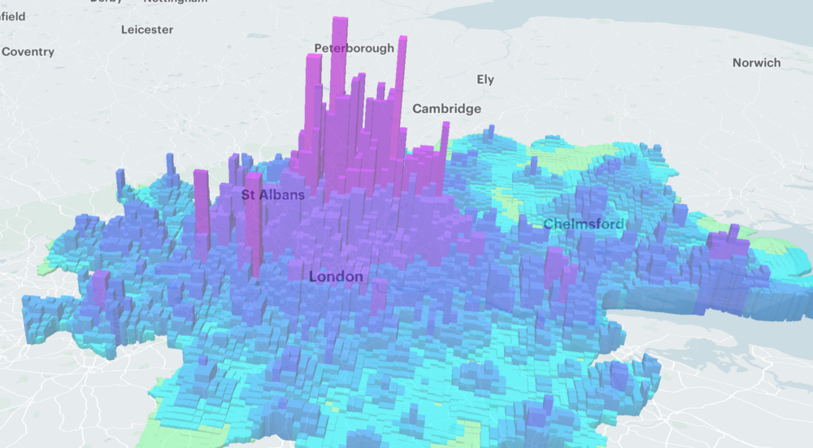

# WORKSHOP Mapbox Pandas
A workshop about Mapbox GL to discover the world data visualization.



## Overview

### Introduction

BLA-BLA-BLA...

### Table of Contents

- [Overview](#overview)
    - [Introduction](#introduction)
    - [Table of Contents](#table-of-contents)
    - [Presences](#presences)
- [Prerequisites](#prerequisites)
- [Workshop](#workshop)
    1. [Data visualization with Mapbox GL](#data-visualization-with-mapbox-gl)
        1. [Display your first map](#display-your-first-map)
        2. [Mark a location in your map](#mark-a-location-in-your-map)
        3. [Resolve the performance problem](#resolve-the-performance-problem)
    2. [Display your own data](#display-your-own-data)
        1. [Discover the open data movement and choose you own dataset](#discover-the-open-data-movement-and-choose-you-own-dataset)
        2. [Clean your dataset](#clean-your-dataset)
        3. [Display your dataset with Mapbox GL](#display-your-dataset-with-mapbox-gl)
- [Discover More](#discover-more)

### Presences
Fork the repository (set yourself as the owner) and commit with your name to be marked present. example: [PRESENCE] : Tomas PROUST

## Prerequisites

For this workshop you will require:
- Python3 (>= 3.7)
    you can install it with the package manager of your choice:
    ```bash
    # Fedora
    sudo dnf install python3
    # Ubuntu and Debian based Distro
    sudo apt-get install python3
    # Arch Linux
    sudo pacman -Sy python-pip
    ```
- Python Pandas library:
    ```bash
    pip install pandas
    ```

## Workshop
by any needs, here the [Mapbox GL documentation](https://docs.mapbox.com/mapbox-gl-js/example/simple-map/).

### Data visualization with MapBox GL
In the first of this workshop we're gonna find out the basics of Mapbox GL.
We'll display a map in our navigator thanks to Mapbox GL,
and then we will play a bit with it by marking locations on the map.

#### Display your first map
We'll be displaying the map with a plain html defining a [Map object](https://docs.mapbox.com/mapbox-gl-js/api/map/), following this [example](https://docs.mapbox.com/mapbox-gl-js/example/simple-map/) show.

You will need to provide an access token to generate the map. It is generated at sign up and as it needs to give your credit card details here an access token you can use: 
```js
mapboxgl.accessToken = 'pk.eyJ1Ijoib2R1LXZlbG8iLCJhIjoiY2xjajl4MGh2MGc5ajN1cWg5anRnbnA3bCJ9.A1vMA06W6lyvtb3KDZW-Kg';
```
Be careful, to be displayed the Mapbox GL object need a "map" division tag, which itself must have css dimensions defined.

To watch your map, you can use the [VS Code Live Server extension](https://marketplace.visualstudio.com/items?itemName=ritwickdey.LiveServer) or open your local html file with your navigator (e.g: ctrl + O on firefox).

#### Mark a location in your map
Next we'll add a marker to the map by defining a [Marker object](https://docs.mapbox.com/mapbox-gl-js/api/markers/#marker).
you can follow check this [example](https://docs.mapbox.com/mapbox-gl-js/example/add-a-marker/).

You can visit the [bbox finder](http://bboxfinder.com) website to find a location to highlight or pick one of these:
Name | longitude | latitude
--- | :---: | ---
Epitech | 2.363021 | 48.815307
Londres | -0.118092 | 51.509865
New York | 40.779897 | -73.968565
Paris | 2.349014 | 48.864716 
Seoul | 37.566535 | 126.9779692
Tokyo | 35.6894 | 139.692

#### Resolve the performance problem
Markers are cool but incompatible with big datasets visualization, as it uses JavaScript to be rendered.
To display a large dataset on map, we must use a [Vector Tileset](https://docs.mapbox.com/mapbox-gl-js/api/sources/#vectortilesource).
A vector tilesets is a tile generated by Mapbox GL from imported data, it can be retrieved in our code with an its ID.

As it needs to sign up to generate your own vector tileset you can use the tileset of this [example](https://docs.mapbox.com/mapbox-gl-js/example/data-driven-circle-colors). We'll see how to generate our own data in later steps.

### Display your own data

#### Discover the open data movement and choose you own dataset

#### Clean your dataset

#### Display your dataset with Mapbox GL

## Discover More